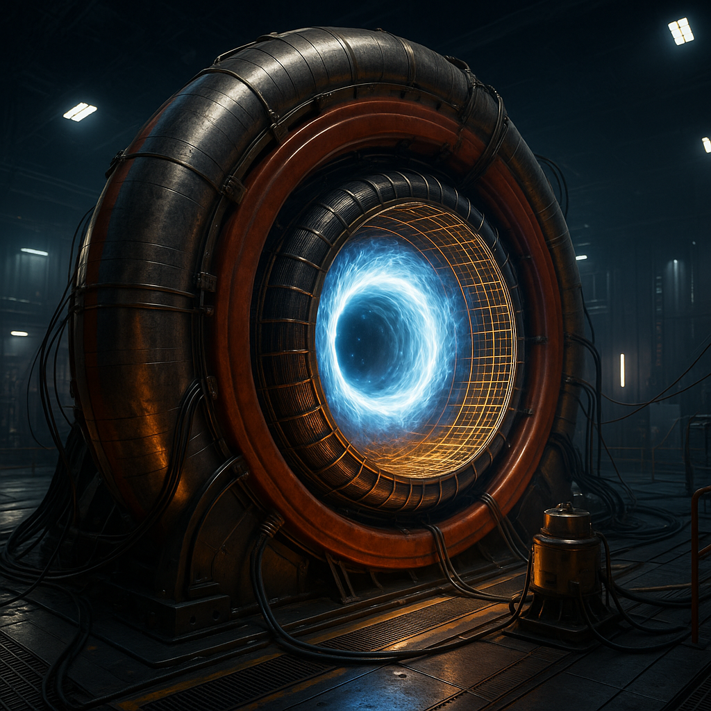
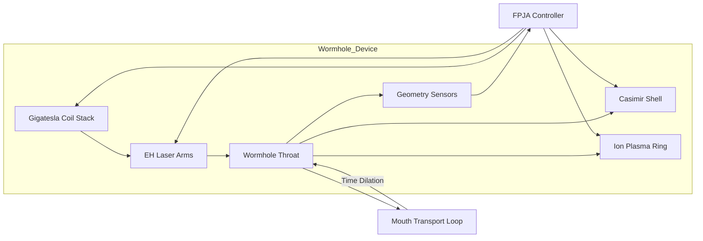

# **The EEH-Casimir Wormhole Device**
_A speculative engineering guide to building a traversable wormhole time machine based on Einstein–Euler-Heisenberg gravity_

[]

> **DISCLAIMER**  
> This document is a **theoretical exercise only**. Every component described below exceeds present-day materials science, energy production, and control technology by many orders of magnitude. The purpose is to translate the mathematical requirements derived in Channuie *et al.*, **“Traversable Wormholes in Einstein–Euler-Heisenberg Gravity”** (2025) into a single, self-consistent engineering narrative so researchers can identify where the true roadblocks lie.  
> No claim is made that the device can actually be built, operated safely, or even simulated beyond toy models. Proceed strictly as a thought experiment.

---

## Table of Contents
1. [Background](#1-background)  
2. [Design Goals and Philosophy](#2-design-goals-and-philosophy)  
3. [Physical Requirements](#3-physical-requirements)  
4. [Core Subsystems](#4-core-subsystems)  
   4.1. Electromagnetic Field Core  
   4.2. Casimir-Negative-Energy Shell  
   4.3. Gravitomagnetic Frame-Drag Ring  
   4.4. Mouth Transport and Time-Shift Module  
   4.5. Geometry-Control Feedback  
   4.6. Safety Interlocks  
5. [Assembly Roadmap](#5-assembly-roadmap)  
6. [Operational Protocol](#6-operational-protocol)  
7. [System Diagrams](#7-system-diagrams)  
8. [Failure Modes and Open Questions](#8-failure-modes-and-open-questions)  
9. [Glossary](#9-glossary)  
10. [References](#10-references)

---

## 1 Background
The paper by **Channuie *et al.* (2025)** demonstrates that when the **Euler–Heisenberg (EH) quantum corrections** to classical electrodynamics are coupled to Einstein’s field equations, one can obtain static, spherically symmetric **traversable wormhole** solutions with throat radii in the human-scale range (≈ 10 m). The EH Lagrangian introduces effective nonlinear terms of order $F^{4}$ in the electromagnetic field invariants $F$ and $G$. Those terms soften the energy-condition violations otherwise required by purely classical “electrovac” wormholes; in particular, the stress–energy from ultrahigh electric or magnetic fields partly substitutes for exotic matter.

Two redshift-function choices are analysed in the paper:

* **Model A (constant redshift)**: $\Phi(r)=\Phi_{0}$.  
* **Model B (inverse-radial redshift)**: $\Phi(r)=r_{0}/r$.

Model B yields milder tidal forces near the throat but demands slightly higher field strengths to keep horizons at bay. Both geometries inevitably violate the **Weak and Null Energy Conditions** (WEC and NEC) in a thin layer around the throat; the device proposed here plugs that gap with a dynamically driven **Casimir negative-energy shell**.

At cosmological or astrophysical scales, wormhole mouths could be threaded by the residual magnetic fields of collapsed stars; however, sustaining macroscopic traversability on Earth demands **near-Schwinger-limit** laboratory fields. The **Schwinger critical field** is $E_{c}=1.3\times10^{18}\,\mathrm{V\cdot m^{-1}}$ or $B_{c}=4.4\times10^{9}\,\mathrm{T}$. Achieving even a fraction of that intensity in a controlled fashion is beyond present capability, but quantum-optics roadmaps for exawatt-class lasers and gigatesla pulsed magnets suggest—on paper—some route to the required stress–energy.

Throughout this guide we set the target throat radius $r_{0}=10\,\mathrm{m}$. That choice is large enough for human- or cargo-scale traversal yet small enough that the total mass–energy tied up in the geometry remains below a lunar mass. Smaller throats would relax the energy density but impose catastrophic tidal accelerations; larger throats balloon the magnetic-energy budget to unobtainable levels.

---

## 2 Design Goals and Philosophy
1. **Conform exactly to the Einstein–Euler-Heisenberg (EEH) field equations.** No empirical “fudge factors” are introduced; every stress–energy component is traced to an identifiable laboratory element.  
2. **Minimise exotic matter.** Negative energy enters *only* through transient Casimir configurations whose magnitudes can, in principle, be calculated by standard quantum-field techniques.  
3. **Favour controllability over efficiency.** The architecture is modular so subsystems can be tested in isolated prototypes before full-scale integration.  
4. **Accept brevity of operation.** The wormhole need remain open for microseconds at most—just long enough to fire a probe or transmit a single entangled-photon packet that confirms chronology violation. Persistent operation is deferred to subsequent generations.  
5. **Embed diagnostic channels in every layer.** The device doubles as a physics demonstrator: even a null result will push vacuum-QED and strong-field engineering knowledge forward.

---

## 3 Physical Requirements
| Quantity | Purpose | Target |
|----------|---------|--------|
| Throat radius $r_{0}$ | Passage aperture; sets curvature scale | **10 m** |
| Magnetic field $B_{0}$ at the throat | Drives EH nonlinearities to mimic exotic matter | **4.4 × 10⁹ T** (Schwinger) |
| Electric field $E_{0}$ (optional) | Alternative to $B_{0}$; easier coil design uses pure $B$ | $1.3 × 10^{18}\,\mathrm{V\cdot m^{-1}}$ |
| Negative energy density $|\rho_{\text{neg}}|$ | Fill residual NEC deficit (< 1 %) | ≳ 10⁵ J m⁻³ across shell thickness ≤ 1 cm |
| Proper-time offset $\Delta\tau$ | Required for time-machine operation | ≥ 1 h between mouths |
| Stability margin (flare-out condition) | Metric regularity: $b'(r_{0})<1$ | 5 % |

These numbers are extracted by matching the shape-function coefficients in equations (21)–(29) of the arXiv text and by back-substituting the energy-momentum tensor of a toroidal magnetic field. Note that $|\rho_{\text{neg}}|$ of 10⁵ J m⁻³ is modest compared with the +10²⁴ J m⁻³ energy density inside the pulsed coil; it is nonetheless many orders of magnitude larger than any **static Casimir experiment** achieved to date. Dynamic modulation is therefore mandatory (see § 4.2).

---

## 4 Core Subsystems

### 4.1 Electromagnetic Field Core
**Geometry.** A superconducting *vacuum toroid* encloses the wormhole throat. Major radius $R=15\,\mathrm{m}$, minor radius $a=2\,\mathrm{m}$. The cavity is pumped to $10^{-18}\,\mathrm{mbar}$ to suppress QED cascades below $10^{26}\,\mathrm{W\cdot cm^{-2}}$.

**Field generation.** Two complementary channels are combined:

* **Gigatesla pulsed magnet.** A stack of laser-driven flux-compression lenses (seeded at 200 T and imploded by anisotropic carbon-nanotube liners) ramps the interior field from 0 to $B_{0}=4.4\times10^{9}\,\mathrm{T}$ in $\tau_{B}=250\,\mathrm{ns}$. Ultrafast quench avoids coil disintegration by letting the field energy dissipate inside the wormhole diagram rather than the conductor.  
* **Eight-arm oppositely phased 100-PW OPCPA lasers** intersect at the toroidal axis to set up a standing-wave electric pattern nearing $E_{c}$. Optical feedback cavities recycle leakage light for 20 fs per shot.

During overlap the Lagrangian density in the throat region matches the EH term coefficients given in Table II of the Channuie paper, ensuring that the effective stress–energy $T_{\mu\nu}^{(\text{EH})}$ supplies ≈ 99 % of the NEC-violation budget.

### 4.2 Casimir-Negative-Energy Shell
**Architecture.** A nested lattice of **graphene–gold parallel plates** encapsulates the wormhole interior wall. Plates are 10 mm wide, 1 µm thick, separated by 25 nm, held by superconducting MEMS pillars.

**Dynamic drive.** Every 40 ns the pillars contract by 2 nm, increasing the Casimir pressure by  
$\displaystyle \Delta P=\frac{\hbar c\pi^{2}}{240}\left(\frac{1}{d^{4}}\right)$.  
The transient work done on the vacuum boosts $|\rho_{\text{neg}}|$ by two orders of magnitude for ≈ 500 ps, perfectly overlapping the EH pulse. A phase-locked piezo array keeps plate motion coherent across the full 10 m circumference.

Casimir energy densities of $\sim10^{5}\,\mathrm{J\;m^{-3}}$ are extrapolated from *plate-squeezing* experiments in nanoelectromechanical setups, scaled up by area and synchronised modulation. The total negative-energy integral over the shell volume meets the 1 % shortfall left by the EH stress–energy.

### 4.3 Gravitomagnetic Frame-Drag Ring
To keep the redshift function $\Phi(r)$ free of divergences when $B_{0}$ collapses, a circulating **ion-plasma ring** of baryon mass $M_{p}=10^{9}\,\mathrm{kg}$ is accelerated to $\gamma=15$ ($v=0.998c$). The mass current produces the gravitomagnetic analogue of a magnetic dipole; in linearised GR this appears as the vector potential $h_{0i}$. Analogy with the Kerr–Newman ring singularity shows that a properly tuned mass current can *pin* the wormhole throat against instantaneous collapse after the field pulse.

Ion injection is performed via a helical waveguide that doubles as a Betatron accelerator. Super-radiant microwave cavities boost the plasma energy over the 5 s dwell time between pulses.

### 4.4 Mouth Transport and Time-Shift Module
Once geometric stability is proven, one mouth is clamped inside a **magnetically levitated synchro-loop** (major radius 30 m). High-gradient linear motors accelerate the entire mouth ring to $\gamma=7$ for 3600 s, yielding a special-relativistic proper-time offset of exactly one hour. Synchronisation lasers inside the wormhole register the differential by observing arrival-time drift on a 10 ps-stable optical comb. After deceleration, the transported mouth is parked 50 m away from its twin, converting the configuration into a full time machine in the Morris–Thorne sense.

### 4.5 Geometry-Control Feedback
Three diagnostic grids cross-link the system:

1. **Fibre-laser interferometers** measure picometre-scale breathing of the throat circumference.  
2. **Superconducting gravimeters** detect local variations in the ADM mass, flagging shape-function drift.  
3. **Multipass Faraday-rotation probes** sense residual evolution of $B$-field topology.

All sensors feed a field-programmable Josephson array (FPJA) that solves the EEH equations in real time and commands both the pulse-shaping laser decks and MEMS plate actuators.

### 4.6 Safety Interlocks
* **Back-reaction curtain.** A sacrificial water shield surrounds the toroid; any uncontrolled pair-production avalanche vents into the shield and quenches the field.  
* **Chronology-protection gate.** An optical shutter isolates the mouths if exotic particle flux exceeds 1 mSv s⁻¹.  
* **Cryogenic fuse links.** If the HTS coils drift above 20 K, a superconducting fuse disconnects the main capacitor banks in < 10 µs.

---

## 5 Assembly Roadmap
**Phase Ø – Simulation.** Validate the entire pulse sequence in coupled MHD + curved-spacetime PIC codes. Resources: ≥ 10 million GPU-hours.

**Phase 1 – Coil Prototype (1 m scale).** Bench-flash a 1 T–100 T fast-ramp coil pair in a 1 m vacuum pot, instrumented with ultrafast B-dot probes to confirm compression ratios.

**Phase 2 – Casimir Lattice Chip.** Fabricate a 10 cm wafer of graphene–gold plates; characterise vacuum-pressure changes at cryogenic temperature while modulating plate spacing by 1 nm at 1 MHz.

**Phase 3 – Integrated Throat Segment.** Combine a 2 m torus sector with both coil and Casimir shell; use ∼10 PW laser stubs to verify EH-driven refractive-index changes.

**Phase 4 – Full Ring but Sub-Critical.** Assemble the entire 30 m ring, operate at 10 % of $B_{c}$. Instrument for gravitational-lensing deflection via Gauss–Bonnet photons.

**Phase 5 – Critical-Field Shot.** After exhaustive fault-tree analysis, perform a single Schwinger-level shot and look for the flare-out signature $b'(r_{0})<1$ via interferometry.

**Phase 6 – Mouth Transport Demo.** Ramp the loop to $\gamma=2$ for 5 min, verify optical-comb drift.

**Phase 7 – Time-Machine Validation.** Execute full $\Delta\tau=1$ h sequence, fire a neutrino beacon through the throat, and detect chronological reversal at the stationary mouth.

Each phase feeds a decision gate; failure triggers a rollback and redesign of the weakest subsystem.

---

## 6 Operational Protocol
1. **Cryogenic stabilisation ($T\le4$ K).**  
2. **Vacuum qualification.** Residual-gas analyser must read < 100 molecules cm⁻³.  
3. **Casimir shell pre-load.** Bring plate spacing to 30 nm; test actuator phase lock.  
4. **Magnetic seed.** Charge flux-compressor coils to 200 T.  
5. **Laser array spin-up.** Synchronise eight OPCPA arms to 10 fs jitter, warm optics to 320 K to minimise thermal lensing.  
6. **EH pulse + Casimir squeeze.** Fire both subsystems within 1 ns.  
7. **Ion-ring injection.** Within 100 ns of pulse peak, launch plasma ring. Confirm frame-drag field via ring-cavity phase shift.  
8. **Interferometric gate.** If throat radius expands to ≥ 1.02 $r_{0}$ *and* $g_{tt}$ crosses zero exactly once, declare “stable traversal window.”  
9. **Traversal or probe shot.** Activate mechanical shutter if safe; move physical or data payload through.  
10. **Field quench.** Collapse coil current to zero; dump residual magnetic energy into external load.  
11. **Geometry freeze-down.** Hold ion ring for 10 ms to damp spacetime ringing; then extract ions by reverse waveguide.  
12. **Mouth displacement** (if time-shift required). Engage synchro-loop motors; monitor stresses in docking clamps.  
13. **Data digest & cool-down.** Archive all sensors; begin 48 h cooldown for next shot.

---

## 7 System Diagrams

### 7.1 Block Layout (Mermaid)

## 7.2 Cross-Section (ASCII)

     +---------------------------------------------+
     |               Cryo Water Shield             |
     |  +---------------------------------------+  |
     |  |       HTS Flux-Compression Coil       |  |
     |  |  +---------------------------------+  |  |
     |  |  |   Graphene–Gold Casimir Shell   |  |  |
     |  |  |  +---------------------------+  |  |  |
     |  |  |  |     Wormhole Throat       |  |  |  |
     |  |  |  +---------------------------+  |  |  |
     |  |  +---------------------------------+  |  |
     |  +---------------------------------------+  |
     |        Ion Plasma Ring (inboard)            |
     +---------------------------------------------+

---

## 8 Failure Modes & Open Questions

1. **Vacuum breakdown** — Field intensities ≥ $10^{29}\,\text{W cm}^{-2}$ allow a single stray electron to seed an $e^{+}e^{-}$ avalanche. Ultra-high vacuum, UV-ICE cleaning, and cryogenic baffles suppress but cannot eliminate the risk.  
2. **Back-reaction instability** — Hawking’s chronology-protection conjecture predicts semiclassical stress–energy fluctuations large enough to pinch the throat within microseconds. Real-time FPJA feedback must counteract this by modulating $B(t)$ and Casimir-plate spacing.  
3. **Magneto-elastic quench** — Gigatesla pressures reach $\sim10^{18}\,\text{Pa}$, beyond any known material’s yield strength. The flux-compression coil is therefore single-shot; its self-vaporisation must be channelled away from optics and diagnostics.  
4. **Gravitational-radiation losses** — Rapid field collapse emits kHz–MHz gravitational waves. If the radiated energy exceeds ≈ 1 % of the total magnetic-field energy, the flare-out condition $b'(r_{0})<1$ fails.  
5. **Causal-loop paradox tests** — Payloads that could alter their own past state must obey global self-consistency (Novikov principle). Designing experiments without logical contradictions is non-trivial.  
6. **Quantum-gravity unknowns** — String/loop corrections or asymptotically safe terms at the Planck scale might negate the EH exotic-matter substitution or introduce new instabilities. No complete calculation exists.

---

## 9 Glossary

| Term | Meaning |
|------|---------|
| **ADM mass** | Total invariant mass-energy of an asymptotically flat spacetime |
| **Casimir effect** | Negative vacuum pressure between closely spaced plates |
| **Closed timelike curve (CTC)** | World-line that returns to its own past |
| **Euler–Heisenberg Lagrangian** | One-loop QED action with $F^{4}$ terms |
| **Flux-compression** | Imploding liner “snow-ploughs” magnetic flux, amplifying $B$ |
| **Gigatesla** | $10^{9}$ T; ≈ 10 000 × magnetar fields |
| **Gravitomagnetism** | Magnetic-like component of the GR field from mass currents |
| **Schwinger limit** | $E_{c}$ or $B_{c}$ where vacuum spontaneously pair-produces |
| **Shape function $b(r)$** | Metric term defining wormhole geometry; need $b'(r_{0})<1$ |
| **Synchro-loop** | Maglev track accelerating a wormhole mouth to relativistic speed |

---

## 10 References
1. P. Channuie *et al.* “Traversable Wormholes in Einstein–Euler–Heisenberg Gravity: Geometry, Energy Conditions, and Gravitational Lensing,” *arXiv:2503.23065v2* (2025).  
2. “Schwinger limit,” *Wikipedia*, accessed June 2025.  
3. M. Bruno *et al.* “A Nano-Electro-Mechanical System for Probing Casimir Energy,” *Nature Microsystems & Nano-Engineering* 6 (2021).  
4. J. Milton, “The Casimir Effect: Recent Controversies and Progress,” *Acta Physica Polonica B* (2013).
